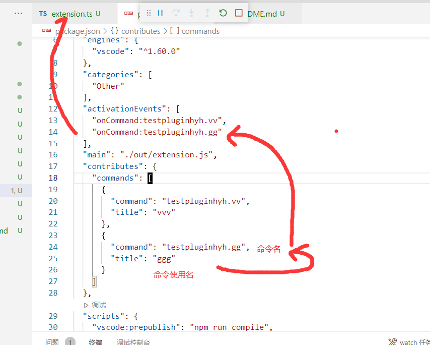
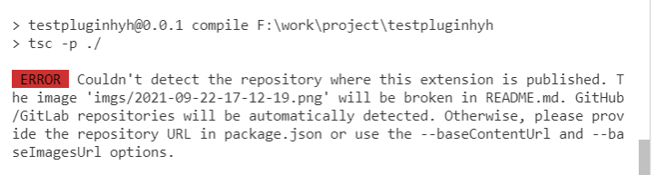
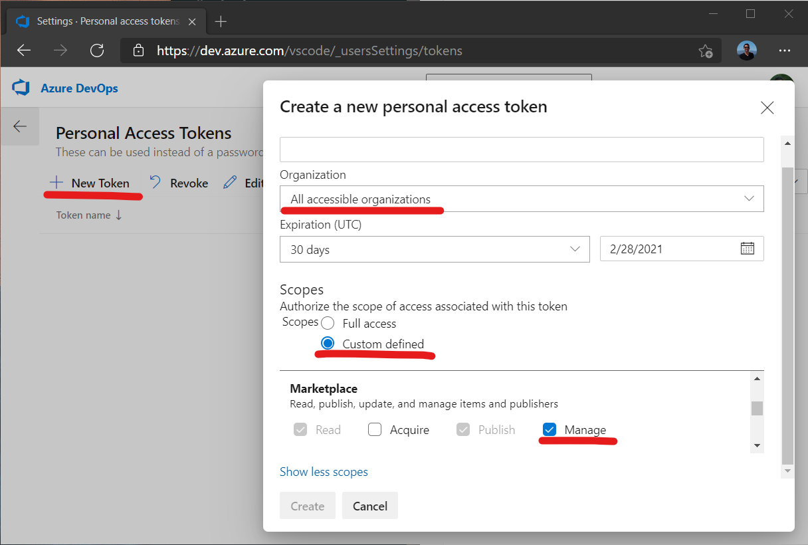
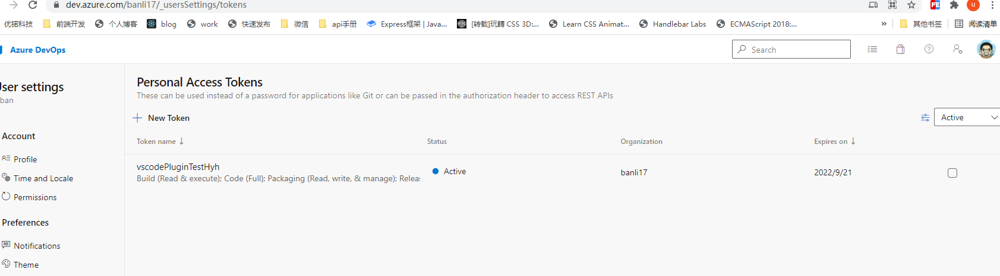

# vscode 插件开发

## 简介

1. 注册激活事件

2. 贡献点, 能 ctrl+shift +p 命令面板使用

3. 编写事件处理函数



## package.json

- name + publisher: VS Code<publisher>.<name>用作扩展的唯一 ID
- main: 扩展入口点。
- activationEvents 和 contributes：激活事件和贡献点。
- engines.vscode：这指定了扩展所依赖的 VS Code API 的最低版本。

### icon 图标

```
"repository": {
    "type": "git",
    "url": "https://github.com/banli17/testVscodePlugin.git"
  },
  "icon": "images/icon.png"
```

## extension.ts

- deactivate: VS Code 关闭或扩展被禁用或卸载时执行

## 发布

```
# vsce 是 Visual Studio Code Extensions 缩写
npm install -g vsce

# 打包
# 需要在 package.json 里指定 git 仓库，沒有会警告, 如果 readme 有相对路径, 会强制需要，会被当做 baseContentUrl
vsce package

# 发布
vsce publish
# 自动增加版本号, 会自动修改 package.json 的 version
vsce publish minor ..
vsce publish 0.0.2

# 取消发布, 会删除数据统计
vsce unpublish (publisher name).(extension name)
```

创建发布者
https://marketplace.visualstudio.com/manage/createpublisher?managePageRedirect=true

发布者组织要对应，用那个 Personal Access Tokens。

banli17 这里要和 vsce login 一致





在线发布地址：https://marketplace.visualstudio.com/manage/publishers/banli17，拖拽上传即可

### 创建账号(组织)

1. 登录 https://login.microsoftonline.com/common/oauth2/authorize?client_id=499b84ac-1321-427f-aa17-267ca6975798&site_id=501454&response_mode=form_post&response_type=code+id_token&redirect_uri=https%3A%2F%2Fapp.vssps.visualstudio.com%2F_signedin&nonce=db8d6f86-03d4-4d2f-b466-377c2fcc6bb7&state=realm%3Dapp.vsaex.visualstudio.com%26reply_to%3Dhttps%253A%252F%252Fapp.vsaex.visualstudio.com%252Fsignup%252F%253FacquisitionId%253Dc2d155ef-e666-4b61-9b01-d742db7611d2%2526mkt%253Dzh-cn%2526acquisitionType%253DbyDefault%26ht%3D3%26mkt%3Dzh-CN%26nonce%3Ddb8d6f86-03d4-4d2f-b466-377c2fcc6bb7&resource=https%3A%2F%2Fmanagement.core.windows.net%2F&cid=db8d6f86-03d4-4d2f-b466-377c2fcc6bb7&wsucxt=1&githubsi=true&msaoauth2=true&mkt=zh-CN

2. 选择 " 新建组织"。

3. 确认信息，然后选择 " 继续"。

https://docs.microsoft.com/zh-cn/azure/devops/organizations/accounts/create-organization?view=azure-devops

https://dev.azure.com/banli17
右上角头像点击 user setting -> Personal Access Tokens

2hpp5kotrb6rkgvpunql56jezckckmyq7cbelrgydcftvqqm6azq



TestPluginHyh

2sljjs2exvbwd2ivpvycbn4g6fhplf66ev2zni7btcyz43efc66a
